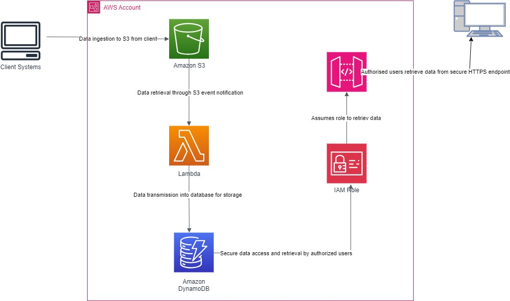

# AWS Serverless Data Migration Project

## Project Overview

This project demonstrates the migration of sample customer data in JSON format from an on-premises drug research company to a serverless architecture on AWS. The solution provides an efficient way to store and access client data while leveraging various AWS services to ensure scalability, reliability, and cost-effectiveness.

### Technologies Used
- **Amazon S3**: For securely storing incoming JSON data.
- **AWS Lambda**: For processing and transferring data to DynamoDB.
- **Amazon DynamoDB**: To serve as a serverless NoSQL database for structured client information.
- **Amazon API Gateway**: To create a secure API for data retrieval.
- **IAM Roles**: To manage permissions and secure access to AWS resources.

## Architecture Overview

The architecture is designed to utilize AWS services for data ingestion, processing, storage, and access. Key components include:

- **Data Ingestion**: Client data in JSON format is uploaded to an S3 bucket.
- **AWS Lambda**: A Lambda function is triggered by S3 events to process and validate the uploaded JSON data before storing it in DynamoDB.
- **DynamoDB**: Stores client information in a NoSQL format, allowing efficient queries.
- **API Gateway**: Provides a secure endpoint for users to access and retrieve the data stored in DynamoDB.

## Project Structure

```
project-root/
│
├── s3-data/                  # Directory for S3 data files
│   └── customer_data.json     # Sample customer data in JSON format
│
├── lambda/                   # Directory for Lambda function code
│   └── script.py              # Lambda function to migrate data from S3 to DynamoDB
│
├── architecture-diagram.png   # Architecture diagram for the project
│
├── README.md                 # Project documentation
└── requirements.txt          # List of dependencies (if any)
```

## Migration Process

1. **Data Storage**: The sample customer data is uploaded to an S3 bucket.
2. **Lambda Function**: A Lambda function is triggered by an S3 event to process the JSON data.
3. **Data Storage**: The processed data is stored in DynamoDB.
4. **API Access**: Users can retrieve data via a secure API endpoint provided by API Gateway.

## Lambda Function Code

The following is the code used in the Lambda function to migrate data from S3 to DynamoDB:

```python
import json
import boto3
from decimal import Decimal

def lambda_handler(event, context):
    print(event)
    s3_bucket = event['Records'][0]['s3']['bucket']['name']
    json_file_name = event['Records'][0]['s3']['object']['key']

    s3_client = boto3.client('s3')
    dynamodb_client = boto3.resource('dynamodb')
    dynamodb_table = dynamodb_client.Table('LibaskiDB')

    try:
        # Get the JSON object from S3
        response = s3_client.get_object(Bucket=s3_bucket, Key=json_file_name)
        json_data = json.loads(response['Body'].read().decode('utf-8'), parse_float=Decimal)
        
        # Insert the JSON data into DynamoDB
        with dynamodb_table.batch_writer() as batch:
            for item in json_data:
                batch.put_item(Item=item)
                
        return {
            'statusCode': 200,
            'body': 'Data successfully loaded into DynamoDB.'
        }
    except Exception as e:
        return {
            'statusCode': 500,
            'body': f'Error: {str(e)}'
        }
```

## Security Considerations

- **Encryption**: Data is encrypted both in transit and at rest using AWS KMS.
- **Access Control**: IAM roles restrict access based on the principle of least privilege.
- **Monitoring**: Utilize AWS CloudWatch to monitor Lambda function executions and track S3 access.

## Conclusion

The implementation of this serverless database solution on AWS provides Libaski Enterprise with a scalable and cost-effective approach to manage JSON data generated during drug research. By leveraging AWS services such as Lambda, DynamoDB, and S3, the solution ensures efficient data transmission, storage, and retrieval while maintaining high security and compliance standards.

## Recommendations

- Regularly monitor and optimize Lambda functions and DynamoDB for performance.
- Implement automated backups and disaster recovery strategies.
- Consider integrating data analytics capabilities for deeper insights.

## References

-   
- [API Gateway Endpoint for Data Retrieval](https://cgf4ne3ece.execute-api.us-east-1.amazonaws.com/dev/users/put_clientid)

## License

This project is licensed under the MIT License. See the LICENSE file for details.

## Author

Emmanuel Ataba   
https://github.com/zele9
